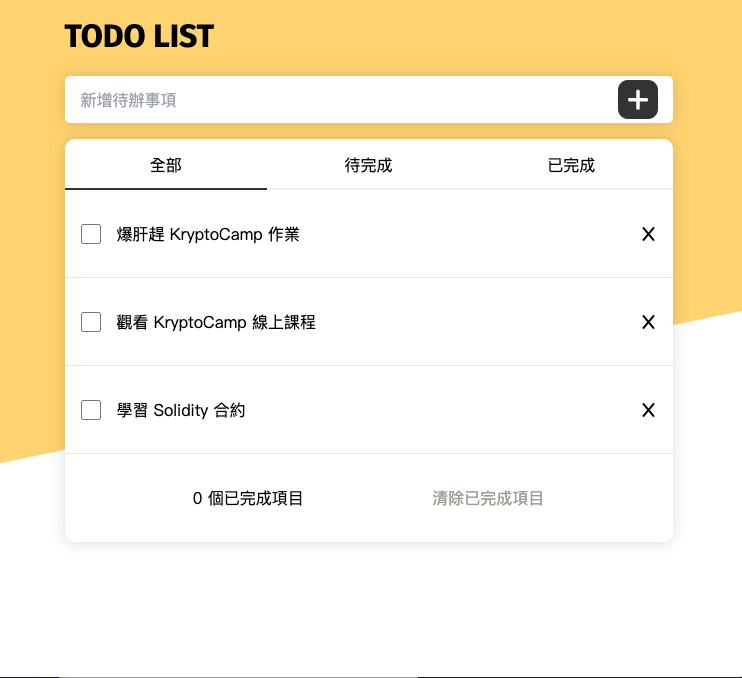

  

  <h3 align="center">Todo List</h3>

  

    🌱 Todo List 待辦事項
     
    <a href="https://github.com/Hazelwu2/todolist-jquery.git/issues">Report Bug</a>
    ·
    <a href="https://stellular-meringue-602b54.netlify.app/#">線上Demo</a>
  

## 🛖 About This Project
含有 index.html、index.css、index.js，用 scss 切版配合 Prepros 快速轉換 css，RWD 並加上 jQuery 實作
部署採用 Netlify 

## 📖 功能
* Create：建立 Todo
* Delete：刪除 Todo
* 篩選：全部、待完成、已完成 Todo
* 響應式設計

## 🔨 Built With
此專案會用到的 Library、工具

* [jQuery](https://jquery.com/)
* [Prepros](https://prepros.io/)
* [tailwindcss](https://tailwindcss.com//)
* [fontawesome](https://fontawesome.com/)
* [Netlify](https://www.netlify.com/)